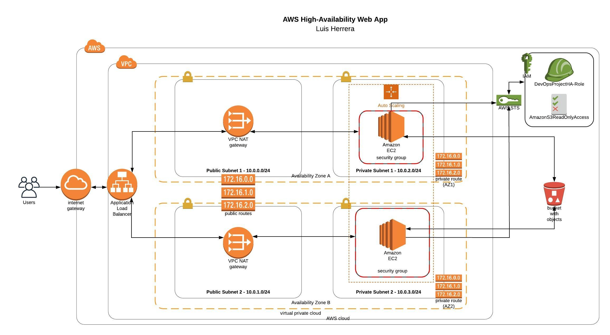

# Deploy a high-availability web app using CloudFormation

In this project, you’ll deploy web servers for a highly available web app using CloudFormation. You will write the code that creates and deploys the infrastructure and web application from the ground up. You will begin with deploying the networking components followed by servers, security roles and software.

## Instructions

The complete Cloudformation script is: **network_and_server.yml** 

For deploy the stack just run: 

    sh create.sh InfraProject network_and_server.yml network_and_server.json