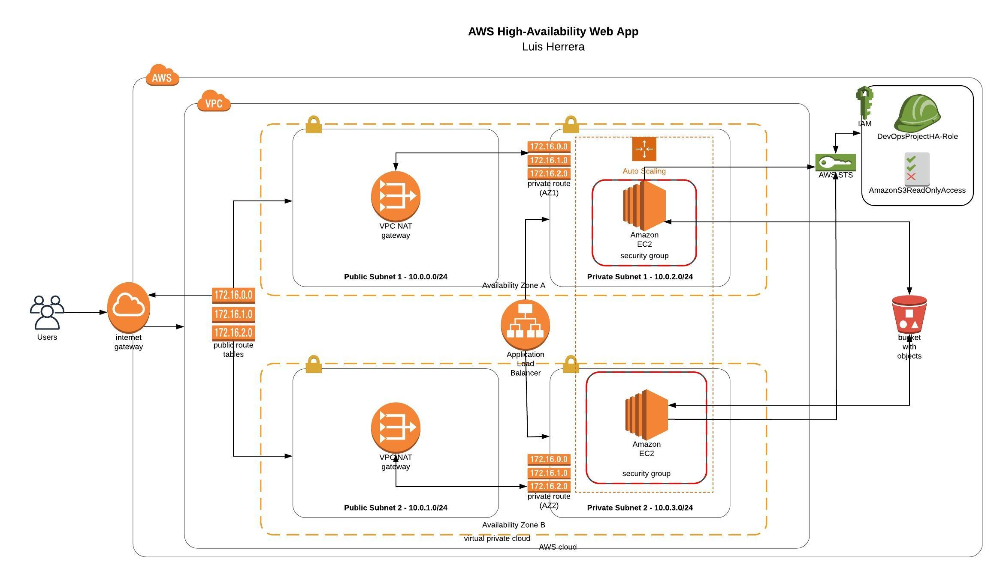

# Deploy a high-availability web app using CloudFormation

This project, deploys a web servers for a highly available web app using CloudFormation. The script begin deploying the networking components followed by servers, security roles and software.

## Instructions

The complete Cloudformation script is: **network_and_server.yml** 

For deploy the stack just run: 

    sh create.sh InfraProject network_and_server.yml network_and_server.json
    
Inside folder [images](https://github.com/herrera-luis/cloud-devops-nanodegree/tree/master/deploy%20HA%20web%20app%20using%20cloudformation/images) you can see the results of script execution
