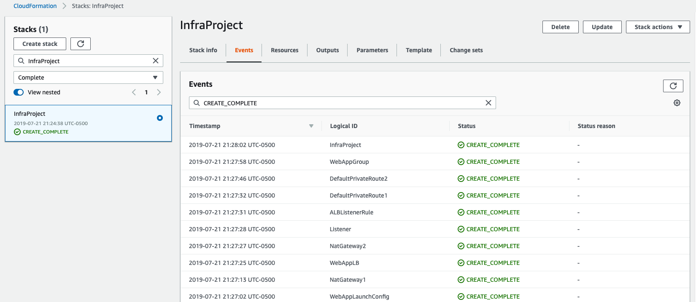

# Images of result execution

#### Executing createcloudformation script

#### Result on web console AWS Cloudformation

####  Outputs_variables

#### Parameters variables

#### S3 bucket used for download artifacts

#### Status healthy of target group

#### App on Browser using LoadBalancerDNSName

