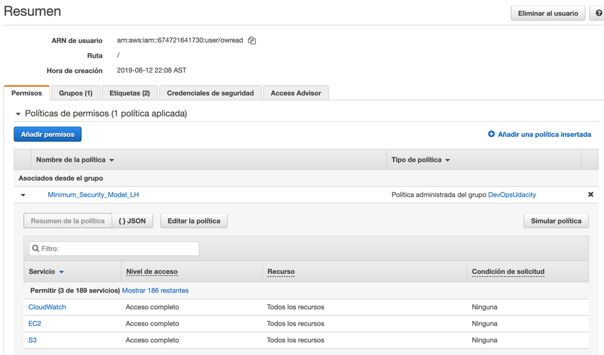
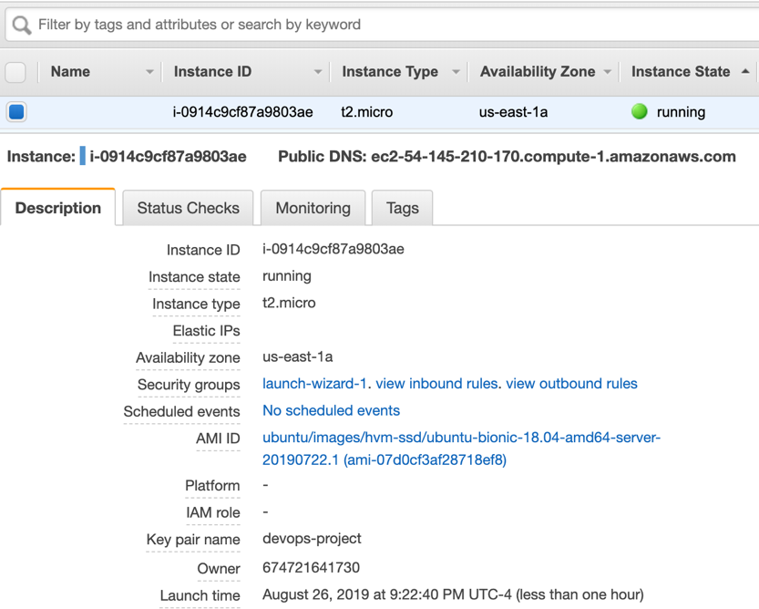
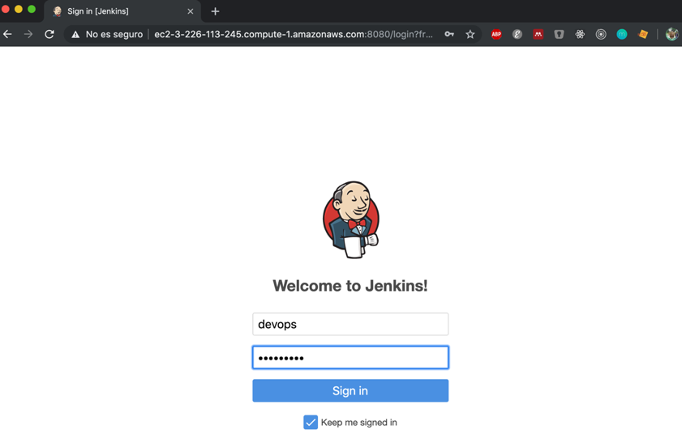
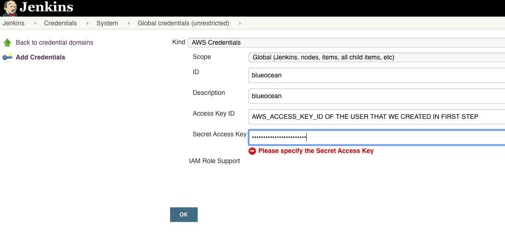
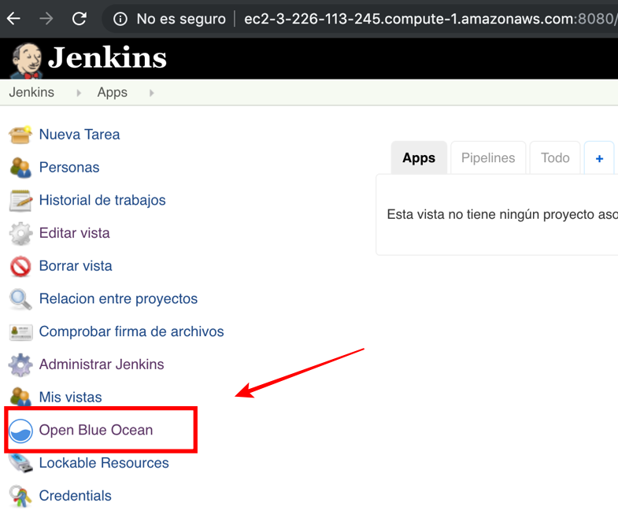
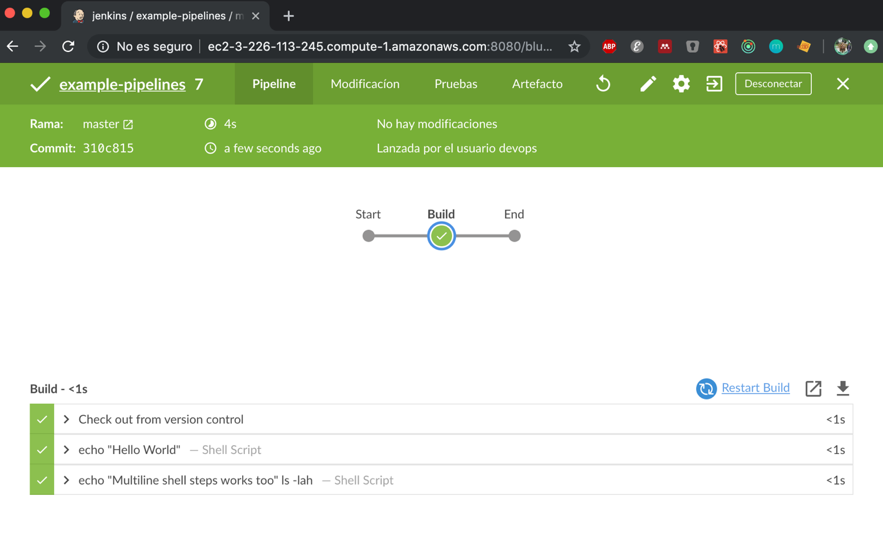

## Step by Step Project

### 1) Create an user and set it minimum privileges to EC2, read and write to S3

### 2) Launch an EC2 instance

### 3) Access to the EC2 instance clone this repo and go to the folder: pipeline with aws integration. Execute the script: **sh ./setup_jenkins.sh** for install Jenkins Pipeline

### 4) Set AWS credentials and Enable Blue Ocean in Jenkins

### 5) Create the pipeline using your repository (You need to have in your repository root folder the file **Jenkinsfile**)

### 6) Update some tag to the index.html file inside artifacts folder for check that linter catch it

### 7) Fix the tag in index.html 

### 8) Go to your S3 Bucket and check that index.html is there

**NOTE: You have to create an S3 Bucket for run this project**
